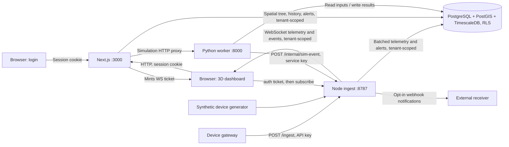
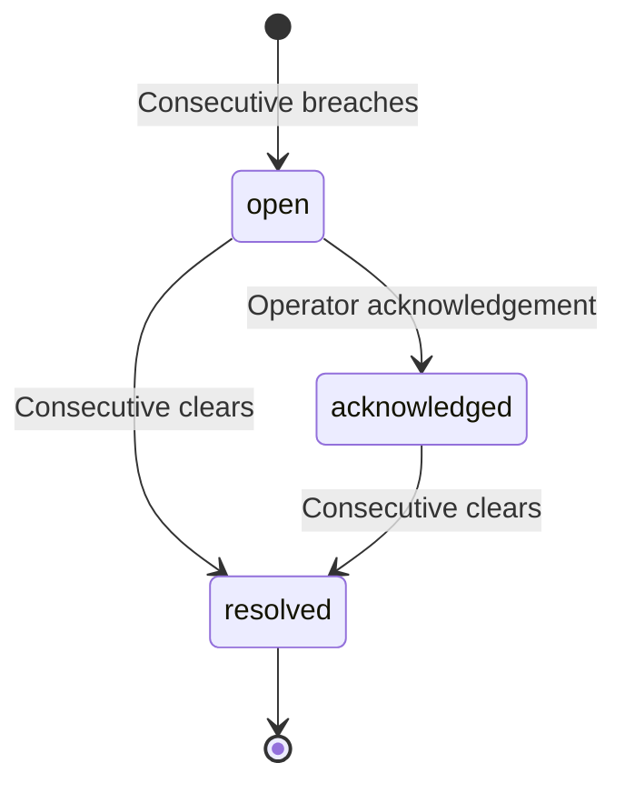

# Architecture

**Implementation reference: 18 September 2026, updated for the multi-tenancy
migration.**

## System boundary

DTwin is an npm-workspaces repository with three applications, two shared
TypeScript packages, and one PostgreSQL database. Python exists only inside
the simulation application.

🚧 **This section describes the target shape.** `packages/db` and `apps/ingest`
are converted for tenancy and multiple buildings/tenants; `apps/web` still
selects the first building ordered by name and does not yet expose a
multi-building or tenant workflow, and `apps/sim` still takes only a
`buildingId`. See [multi-tenancy.md](multi-tenancy.md) for exact status.

The diagram shows the target logical connections. `apps/ingest` enforces every
edge into it: `POST /ingest` and `POST /internal/sim-event` require an API key
scoped to a tenant, and the WebSocket refuses every message but `auth`/`ping`
until a signed ticket authenticates the connection. `apps/web` does not yet
mint tickets or sessions — the `U`/session-cookie/ticket-minting edges above
describe work not yet built; today's dashboard talks to ingest exactly as it
did before this migration, unauthenticated, and its own database reads are
still unscoped. See [multi-tenancy.md § Consequences elsewhere](multi-tenancy.md#consequences-elsewhere).
Database and application ports are published by development Compose.

## Responsibilities and code map

| Component | Owns | Primary code |
|---|---|---|
| `apps/web` | Server-rendered spatial tree, client-only 3D, history and alert reads, simulation proxy. **Not yet tenant-scoped or authenticated.** | [page](../apps/web/app/page.tsx), [dashboard](../apps/web/components/Dashboard.tsx), [routes](../apps/web/app/api) |
| `apps/ingest` | Device ingest, quality assessment, batching, subscriptions, alert evaluation, notifications, synthetic readings — all tenant-scoped; API-key and WebSocket-ticket authentication on every route | [server](../apps/ingest/src/server.ts), [auth](../apps/ingest/src/auth.ts), [pipeline](../apps/ingest/src/pipeline.ts), [rules](../apps/ingest/src/rules/index.ts), [tenant enumeration](../apps/ingest/src/tenants.ts) |
| `apps/sim` | Weather assembly, solar geometry, zone heat balance, run status and results. **Not yet tenant-scoped** — every route still takes only a `buildingId` | [API](../apps/sim/app/main.py), [engine](../apps/sim/app/engine.py), [repository](../apps/sim/app/repository.py) |
| `packages/types` | Zod contracts, inferred types, IDs, enums, WebSocket protocol, tenancy/identity contracts | [exports](../packages/types/src/index.ts), [tenancy](../packages/types/src/tenancy.ts) |
| `packages/db` | PostgreSQL pool (app role + owner role), raw SQL migrations, tenant-scoped spatial/time-series/tenancy queries, session/API-key auth | [client](../packages/db/src/client.ts), [auth](../packages/db/src/auth.ts), [queries](../packages/db/src/queries), [migrations](../packages/db/migrations) |

The applications share database ownership; there is no central data API through
which every query passes. Next.js performs dashboard reads directly and proxies
simulation calls. General asset CRUD is not implemented merely because this
surface is the intended place for it. **Every query in `packages/db` and
`apps/ingest` now takes an explicit tenant-scoped `Db` handle from
`withTenant(...)`** — see [schema.md § Tenancy and identity](schema.md#tenancy-and-identity-007_tenancysql-008_tenancy_timeseriessql)
for what that changes about how a query is written.

## Telemetry flow and guarantees

1. A gateway authenticates with an API key and posts up to 10,000 readings
   identified by `externalId`. Ingest parses the batch with `RawTelemetryBatch`
   and resolves IDs against its sensor registry, scoped to the **key's own
   tenant** — `external_id` is unique only within a tenant since migration
   `007`, so resolution is keyed by `(tenantId, externalId)`, not `externalId`
   alone. A real id belonging to a different tenant is reported as unknown,
   identically to one that does not exist anywhere. Unknown IDs are reported
   and omitted, with an asynchronous registry refresh.
2. The quality gate applies the sensor's plausible range and supplied quality.
   Flagged values are retained as diagnostic evidence.
3. Each resolved reading enters the memory writer buffer, topic fan-out, and
   alert engine. These paths do not wait for telemetry persistence to finish.
4. The writer flushes on interval or size. The SQL insert ignores already-stored
   `(sensor_id, time)` pairs. Within a buffered batch, deduplication keeps the
   last value; after persistence, retransmission does not replace the first row.
5. The browser receives compact `[sensorId, epochMs, value, quality]` tuples.
   History comes from continuous aggregates.

`202 Accepted` means memory acceptance, not durability. A reading can appear
live before its database write succeeds. When the buffer overflows it drops
oldest telemetry; an abrupt process exit also loses buffered data. A gateway
requiring durable receipt needs an additional protocol and persistence design.

Default writer settings are 1 second / 5,000 rows, with a 100,000-row buffer.
Fan-out batches every 250 ms and skips sends above 1,000,000 queued socket bytes.
These are configuration defaults, not performance promises.

Sources: [pipeline](../apps/ingest/src/pipeline.ts),
[writer](../apps/ingest/src/writer.ts), [fan-out](../apps/ingest/src/fanout.ts),
[configuration](../apps/ingest/src/config.ts).

## Spatial and historical data

The hierarchy is building → floors → zones, with sensors and equipment attached
to physical context. Equipment location and equipment service are separate:
`equipment_zone_service` represents many-to-many serving relationships and load
fractions; `parent_equipment_id` represents plant hierarchy.

All interior geometry uses a local metre CRS, SRID 0, with +Z up. Only
`buildings.location` uses WGS84. Rendering extrudes stored zone polygons and
applies one −90° X rotation for three.js. GLTF identifiers are metadata, not a
second geometry source in the current render path.

Raw telemetry uses one-day chunks, compression after seven days, and two-year
retention. The 5-minute/hourly/daily continuous aggregates derive directly from
raw readings. Hourly and daily summaries hold reset-aware counters; cumulative
consumption must use `delta(counter)`, not averages. Counter deltas at 5-minute
resolution are null. All aggregate value calculations currently include flagged
samples, with a separate bad-quality count.

Dashboard history and heatmaps use aggregates. **Implementation exception:**
`getLatestReadingsForZone` reads raw telemetry over the last 24 hours and marks a
point stale after three expected sampling intervals. This differs from the
repository's aggregate-only dashboard rule and should be resolved deliberately.

See the [schema reference](schema.md) and
[telemetry queries](../packages/db/src/queries/telemetry.ts).

## Alert lifecycle and delivery

Instant conditions evaluate on readings. Windowed conditions—flatline, no data,
and rate of change—evaluate on a timer. Rule scopes expand to concrete sensors.
Rate of change uses least-squares regression; value rules exclude flagged
samples, while out-of-range detects them.

A later breach after cooldown creates a new alert. Live alerts are adopted on
startup; a partial unique index prevents duplicate live records for a target.
This does not establish distributed rule evaluation or reliable event delivery.

Notifications run after an alert is persisted. Webhook/log channels have delivery
implementations; email records a failure because no transport exists. The
notification table stores one record per alert/channel/target, with cumulative
attempt count and the last error—not a separate immutable row for every retry.
Only unresolved alerts' webhook records are retried, within the attempt limit.

Alert events bypass telemetry batching, but the shared socket send method still
skips them for slow clients. Durable database alerts and live browser events
therefore provide different guarantees. See the [risk register](cto-assessment.md#risks-and-completion-criteria).

## Simulation flow

The browser posts a scenario through `/api/simulate`; the worker validates it,
creates a queued run, and executes it in a FastAPI background task. It loads
building/zone profiles and occupancy schedules, constructs weather, advances
the thermal model, and writes interval results in batches. Missing thermal
profiles exclude zones, and the start response reports their count.

Progress is stored on the run and posted best-effort to ingest. Ingest forwards
events to `sim:<runId>` and `building:<buildingId>`. The browser supports these
events and also polls HTTP. The dashboard currently changes from building to
floor subscriptions when a floor is selected, so progress can fall back to
polling in that view.

The UI presets use the same fixed 20–23 June 2026 period and synthetic weather:
baseline, +2 K setpoint, half lighting power, and 1.25× COP. The worker API is
more general than this preset UI. Results and run state persist; the background
job itself does not survive process loss.

Model assumptions and output interpretation are in
[the CTO assessment](cto-assessment.md#simulation-credibility) and
[simulation guide](../apps/sim/README.md).

## Change boundaries

Read [decisions.md](decisions.md) before data-model changes. Migrations are
append-only; keep SQL enums and TypeScript enums aligned. Python's
`app/models.py` must mirror `packages/types/src/simulation.ts`, including the
difference between omitted overrides and explicit nulls. Source packages use
`.ts` imports with `noEmit`; React, R3F, and drei versions must remain compatible.
